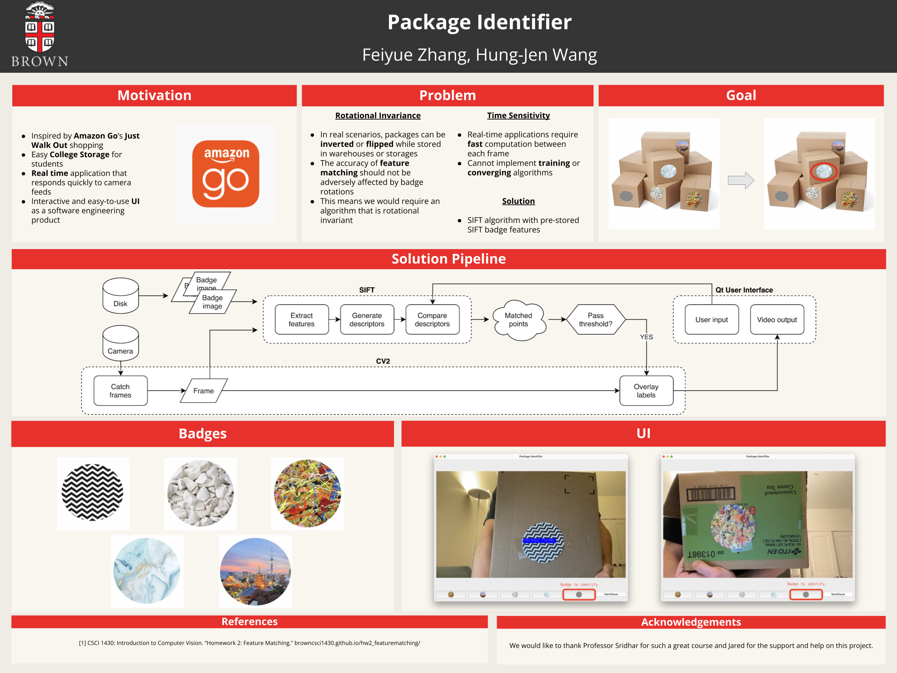

## Motivation

As the school year wraps up, college students often face the challenge of finding affordable and efficient storage options. While self-storage can be expensive, sharing storage space with others can lead to privacy concerns. This project was born from the need to address these issues and provide a solution that balances security and convenience for everyone involved.

Our Package Identifier system is designed to streamline the storage process by ensuring that students can securely store their packages without worrying about privacy breaches. Each student is given a unique identifier, and all packages are stored together, allowing for cost-effective storage while maintaining individual privacy. This system not only saves students money but also increases the overall efficiency of storage providers by simplifying the retrieval process.

Beyond college storage, our approach to using unique identifiers and image recognition has broad potential applications. The same technology can be used to enhance manual organization tasks, improve item tracking in images, and even autonomously label objects in pictures, making it a versatile tool for various industries.

## Poster Presentation

## Note

This project was developed in collaboration with [@feiyue-z](https://github.com/feiyue-z). The code is available upon request.
